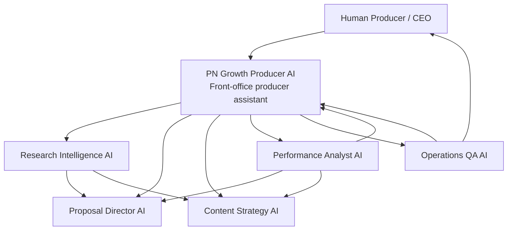

# PN AI Workforce Organization

## COO Assessment

PN Growth Producer AI is useful, but it is currently doing too many jobs.

It acts as:

- Sales assistant
- Proposal writer
- SNS strategist
- Content planner
- Client success analyst
- KPI analyst
- QA reviewer
- Prompt improvement manager

That is acceptable for a prototype, but not for a real AI workforce. A scalable AI workforce needs role separation, clear handoffs, measurable outputs, and human approval gates.

The right design:

- Human producer keeps judgment, relationships, taste, negotiation, final pricing, and quality control.
- PN Growth Producer AI becomes the front-office producer assistant.
- Specialist AI employees handle research, proposal production, content operations, client performance, and operations/QA.

## 1. Tasks That Should Remain With the Human Producer

These tasks require taste, trust, negotiation, reputation control, or final accountability.

## Strategic Judgment

- Decide which clients PN should accept.
- Decide final positioning for important clients.
- Decide when to prioritize money, reputation, culture, or long-term relationship.
- Decide whether a project fits PN's mission.

## Relationship Ownership

- Lead high-stakes sales calls.
- Build trust with founders, executives, creators, and partners.
- Ask sensitive questions about money, urgency, internal politics, and decision-making.
- Manage difficult client conversations.

## Final Commercial Decisions

- Approve pricing.
- Approve scope.
- Approve discounts or payment terms.
- Approve retainers, revenue share, or strategic partnership terms.
- Decide when to walk away.

## Taste and Creative Direction

- Approve final concept direction.
- Decide whether content feels culturally right.
- Decide what should or should not be associated with PN.
- Protect nuance, tone, and reputation.

## Final Client-Facing Approval

- Approve final proposals.
- Approve final reports.
- Approve final SNS strategy.
- Approve claims about expected outcomes.
- Approve public content before publishing.

## 2. Tasks To Delegate To PN Growth Producer AI

PN Growth Producer AI should remain the first-line producer assistant.

Delegate:

- Sales call analysis
- Deal scoring
- Proposal readiness checks
- First-draft proposal structure
- SNS strategy drafts
- Content pillar drafts
- Content idea generation
- Client improvement recommendations
- Follow-up message drafts
- Objection analysis
- Missing information lists
- First-pass KPI recommendations
- Draft monthly improvement summaries

Do not delegate final approval.

## 3. Tasks Requiring Additional AI Employees

PN Growth Producer AI should not own everything below. These need specialist AI employees:

- Market, competitor, and client research
- High-ticket proposal assembly and pricing logic
- Content production operations and repurposing
- KPI analysis, attribution, and client performance diagnosis
- Workflow QA, SOP creation, and AI workforce performance review

## AI Workforce Org Chart

## Handoff Model

1. Human Producer captures opportunity or client need.
2. Growth Producer AI analyzes the situation and routes work.
3. Research Intelligence AI gathers context and evidence.
4. Proposal Director AI builds commercial proposal drafts.
5. Content Strategy AI creates content systems and campaign plans.
6. Performance Analyst AI measures outcomes and improvement opportunities.
7. Operations QA AI checks quality, scope, risk, SOPs, and AI output performance.
8. Human Producer approves final client-facing decisions.

## Next 5 AI Employees

## AI Employee 1: Research Intelligence AI

## Mission

Turn scattered client, market, competitor, and audience information into structured intelligence that improves sales, strategy, proposals, and content.

## Responsibilities

- Research client business context
- Research competitors and market positioning
- Summarize client website, SNS, and public presence
- Identify audience needs and objections
- Extract useful facts from call notes, Drive docs, reports, and prior work
- Prepare research briefs for proposals and SNS strategies
- Separate facts, assumptions, and unknowns
- Create missing-data questions for the client

## Inputs

- Client website
- Client SNS accounts
- Sales call notes
- Client intake forms
- Google Drive docs
- Existing strategy docs
- Competitor links
- Market notes
- Previous proposals and reports

## Outputs

- Client intelligence brief
- Competitor comparison
- Audience insight memo
- Facts / assumptions / unknowns table
- Missing data request
- Opportunity map
- Research-backed positioning options

## Workflows

1. Client Research Brief
   - Receive client name and goal.
   - Gather available internal and external context.
   - Summarize business, audience, offer, channels, and gaps.
   - Identify missing information.
   - Send brief to Growth Producer AI and Proposal Director AI.

2. Competitor Scan
   - Compare 3-5 competitors.
   - Identify positioning, content patterns, proof, and gaps.
   - Recommend differentiation angles.

3. Audience Insight Extraction
   - Analyze FAQs, comments, reviews, interviews, and call notes.
   - Extract fears, desires, objections, and decision triggers.

## Required Tools

- Browser/search tools
- Google Drive
- Google Docs
- Google Sheets
- Notion or repo knowledge base
- SNS profile access or exports
- Call transcript storage

## KPIs

- Research brief completion within 24 hours
- Percentage of proposals supported by research brief
- Number of missing-data issues caught before proposal
- Number of useful audience insights extracted
- Reduction in generic strategy recommendations

## AI Employee 2: Proposal Director AI

## Mission

Create high-ticket proposal drafts that sell business outcomes, protect margin, and make the next client decision easy.

## Responsibilities

- Turn sales analysis into proposal drafts
- Create diagnostic pitches
- Build scope, deliverables, timelines, and success metrics
- Recommend pricing ranges for human review
- Identify scope risks
- Turn objections into proposal improvements
- Create follow-up messages
- Maintain proposal sections and reusable language

## Inputs

- Sales call analysis
- Research Intelligence AI brief
- Offer menu
- Pricing rules
- Case studies
- Client goal
- Budget signal
- Timeline
- Human producer notes

## Outputs

- Proposal draft
- Diagnostic pitch
- Scope options
- Pricing recommendation
- Risk and assumption list
- Follow-up message
- Proposal critique checklist
- Objection response language

## Workflows

1. Proposal Readiness Check
   - Score readiness 1-5.
   - Block full proposal if decision-maker, urgency, budget, or business outcome is unclear.
   - Recommend diagnostic or further discovery.

2. High-Ticket Proposal Draft
   - Build proposal from client problem and desired business outcome.
   - Tie every deliverable to impact.
   - Include assumptions and human review items.

3. Proposal Red-Team
   - Critique unsupported claims.
   - Identify pricing risk.
   - Identify scope creep risk.
   - Improve proposal before human approval.

## Required Tools

- Google Docs
- Proposal templates
- CRM or pipeline sheet
- Offer menu
- Pricing rules
- Case study library
- Call transcripts

## KPIs

- Proposal draft within 24 hours of qualified call
- 80% of qualified proposals start from AI draft
- Proposal readiness score accuracy
- Proposal-to-close rate
- Average proposal value
- Number of scope risks caught before sending

## AI Employee 3: Content Strategy AI

## Mission

Turn strategy, research, sales objections, and client proof into content systems that create awareness, trust, inquiries, applications, and reusable assets.

## Responsibilities

- Create SNS strategies
- Define content pillars
- Generate weekly content ideas
- Design content experiments
- Repurpose core ideas across channels
- Turn objections into content
- Turn client proof into content
- Create content calendars
- Identify reusable content assets

## Inputs

- Client intelligence brief
- SNS strategy
- Content performance data
- Sales objections
- FAQs
- Client proof
- Campaign goals
- Current offers
- Audience insight memo

## Outputs

- SNS strategy draft
- Content pillars
- Weekly content ideas
- Content calendar
- Hooks and formats
- CTA recommendations
- Repurposing plan
- Content experiment plan

## Workflows

1. Strategy to Content System
   - Convert client goal into content pillars.
   - Define platform roles.
   - Create monthly themes and weekly ideas.

2. Objection to Content
   - Take objections from sales calls.
   - Create content that answers hesitation before sales calls.

3. Content Experiment
   - Create hypothesis.
   - Define KPI.
   - Select format and channel.
   - Review outcome with Performance Analyst AI.

## Required Tools

- SNS analytics exports
- Google Sheets content calendar
- Canva or design tools
- Google Drive assets
- Client proof library
- Sales objection library

## KPIs

- Weekly content ideas delivered on schedule
- Percentage of content tied to a funnel stage
- Number of content experiments run
- Number of reusable content assets created
- Improvement in profile visits, DMs, link clicks, applications, or inquiries

## AI Employee 4: Performance Analyst AI

## Mission

Measure whether PN's work is improving client results, identify what is working, and recommend next actions based on evidence.

## Responsibilities

- Analyze monthly KPI data
- Detect missing metrics
- Build attribution plans
- Track content and campaign performance
- Identify winning and losing patterns
- Recommend client improvements
- Identify justified upsells
- Create reporting summaries
- Feed lessons back to Growth Producer AI and Content Strategy AI

## Inputs

- Project data
- Task data
- SNS analytics
- Application or inquiry data
- Sales/recruiting funnel data
- Client feedback
- Monthly reports
- Content calendar
- Experiment results

## Outputs

- Monthly performance review
- KPI dashboard summary
- Missing data report
- Attribution plan
- Experiment analysis
- Client improvement recommendations
- Upsell recommendation
- Case study data package

## Workflows

1. Monthly Performance Review
   - Collect KPI data.
   - Compare against goal.
   - Identify wins, misses, and missing data.
   - Recommend next month actions.

2. Attribution Setup
   - Define source tracking.
   - Connect SNS/content to inquiries, applications, sales calls, or hires.
   - Create manual fallback if tools are not ready.

3. Experiment Analysis
   - Compare hypothesis to result.
   - Decide scale, revise, or stop.
   - Send lessons to Content Strategy AI.

## Required Tools

- Google Sheets
- CSV exports
- SNS analytics
- CRM/pipeline data
- Application tracking data
- `data/projects.csv`
- `data/tasks.csv`
- Monthly reports

## KPIs

- 100% of active clients reviewed monthly
- Missing KPI report produced before client report
- Number of insights tied to measurable data
- Number of justified upsells identified
- Number of case-study-ready outcomes captured
- Reduction in unmeasured recommendations

## AI Employee 5: Operations QA AI

## Mission

Protect PN's quality, margin, delivery rhythm, and AI workforce reliability.

## Responsibilities

- Review AI outputs for quality and risk
- Check proposals for scope creep
- Check client deliverables against standards
- Maintain SOPs
- Track overdue tasks and waiting items
- Identify margin risks
- Run weekly AI workforce review
- Update prompt improvement logs
- Ensure outputs are saved in the right folders

## Inputs

- AI outputs
- Human feedback
- Project dashboard
- Task data
- Proposals
- Reports
- SOPs
- Prompt logs
- Client feedback

## Outputs

- QA review
- Scope risk report
- Delivery risk report
- SOP updates
- Prompt improvement recommendations
- Weekly AI workforce review
- Quality scorecard
- Human escalation list

## Workflows

1. External Output QA
   - Review proposal, strategy, report, or content before client use.
   - Score risk and quality.
   - Flag unsupported claims or missing data.

2. Delivery Risk Review
   - Check overdue tasks, waiting client items, high revision count, and low margin risk.
   - Recommend escalation or change order.

3. AI Workforce Review
   - Score each AI employee's outputs.
   - Identify weak prompts.
   - Update prompt improvement log.
   - Recommend new SOPs or folder changes.

## Required Tools

- Project dashboard
- Task tracker
- Git/repo knowledge base
- Google Docs
- Google Sheets
- Prompt library
- Output folders
- Monthly reports

## KPIs

- 100% of client-facing outputs reviewed before use
- Zero unapproved pricing or scope promises
- Number of scope risks caught
- Number of overdue/waiting tasks flagged
- Prompt improvement actions completed weekly
- Reduction in low-quality AI outputs

## Human + AI Responsibility Matrix

| Work Area | Human Producer | Growth Producer AI | Specialist AI |
| --- | --- | --- | --- |
| Client acceptance | Final decision | Fit analysis | Research support |
| Sales call | Lead call | Analyze and summarize | Research support |
| Proposal | Approve final | Draft direction | Proposal Director AI |
| Pricing | Final decision | Recommend range | Proposal Director AI |
| SNS strategy | Approve direction | Draft strategy | Content Strategy AI |
| Content ideas | Approve taste | Generate ideas | Content Strategy AI |
| KPI analysis | Decide action | Summarize | Performance Analyst AI |
| Client improvement | Approve recommendation | Draft plan | Performance Analyst AI |
| QA | Final accountability | Flag issues | Operations QA AI |
| SOPs | Approve | Suggest | Operations QA AI |

## Implementation Order

## Phase 1: Stabilize Growth Producer AI

Use current Growth Producer AI daily.

Required:

- Baseline data intake
- Proposal readiness checks
- Human review
- Output quality scoring

## Phase 2: Add Proposal Director AI

Reason:

- Revenue is the bottleneck.
- Proposal quality and speed matter most.

First outputs:

- Proposal readiness checks
- Proposal drafts
- Proposal critiques

## Phase 3: Add Research Intelligence AI

Reason:

- Better proposals and content require better input data.

First outputs:

- Client intelligence briefs
- Competitor scans
- Missing data requests

## Phase 4: Add Performance Analyst AI

Reason:

- PN must prove results and identify upsells.

First outputs:

- Monthly performance reviews
- Attribution plans
- Missing KPI reports

## Phase 5: Add Content Strategy AI

Reason:

- Content volume and quality can scale after strategy and measurement improve.

First outputs:

- Content calendars
- Content experiments
- Repurposing plans

## Phase 6: Add Operations QA AI

Reason:

- As volume grows, quality and margin need protection.

First outputs:

- Output QA
- Delivery risk reports
- AI workforce review

## Operating Principle

Do not build AI employees for novelty.

Build an AI employee only when:

- The task repeats weekly
- The task has clear inputs and outputs
- The output can be reviewed by a human
- The task improves revenue, client results, margin, quality, or speed
- There is a folder, workflow, KPI, and owner

