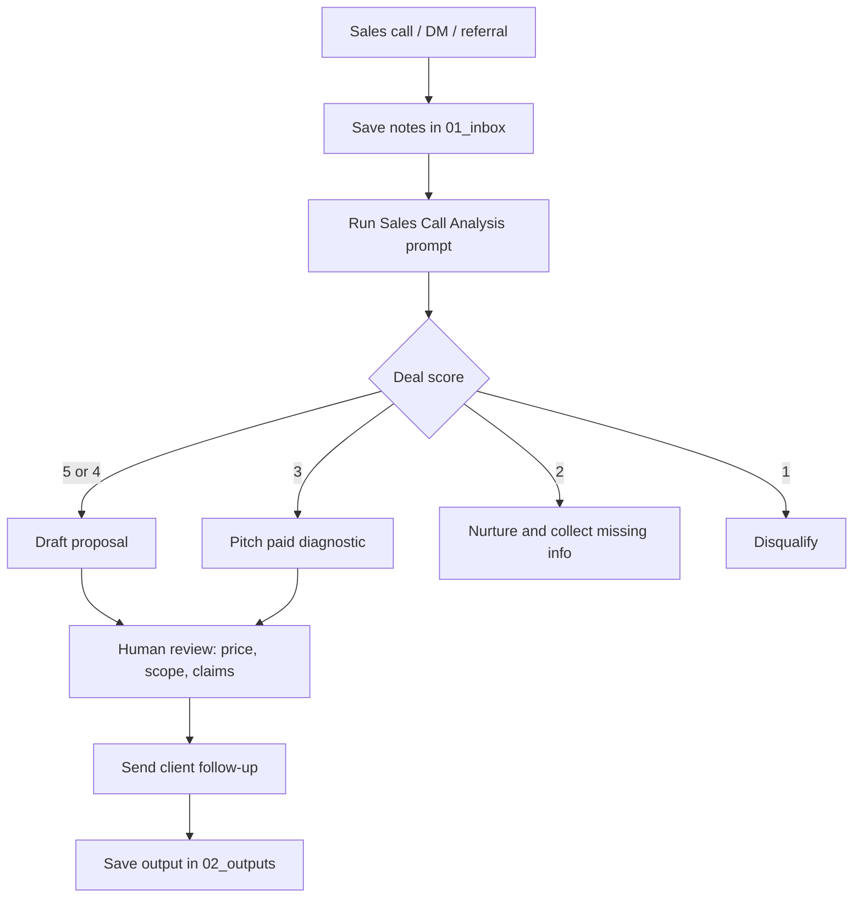
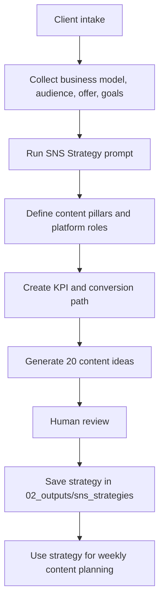
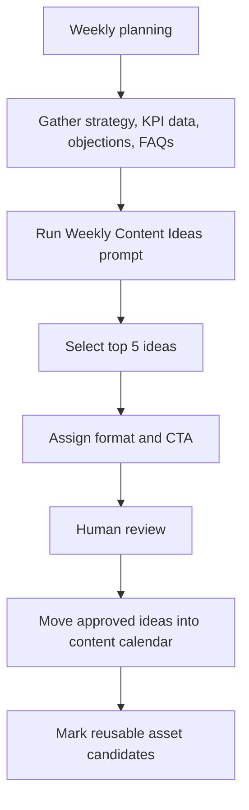
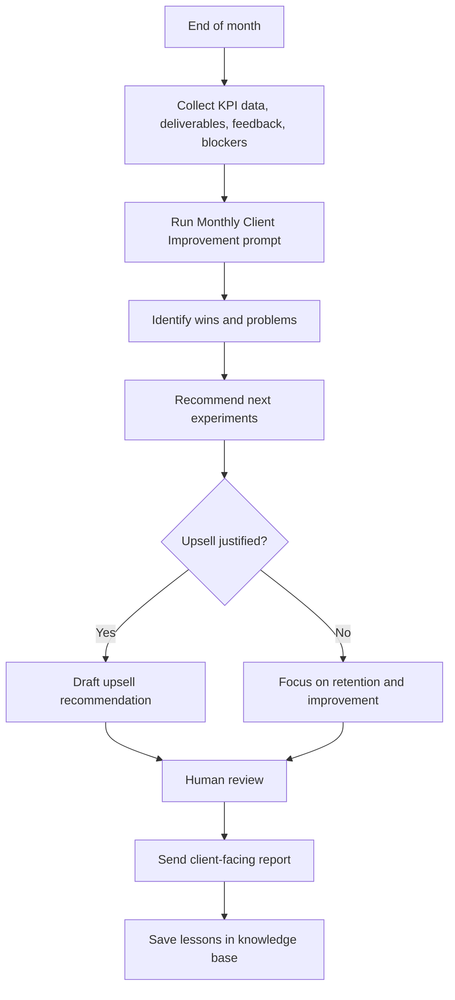
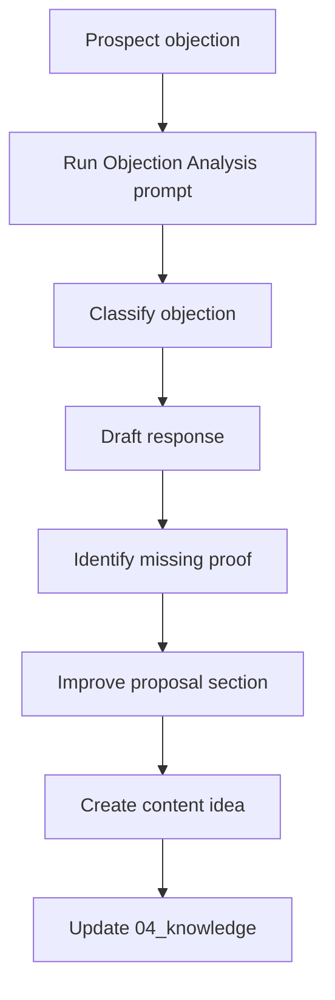
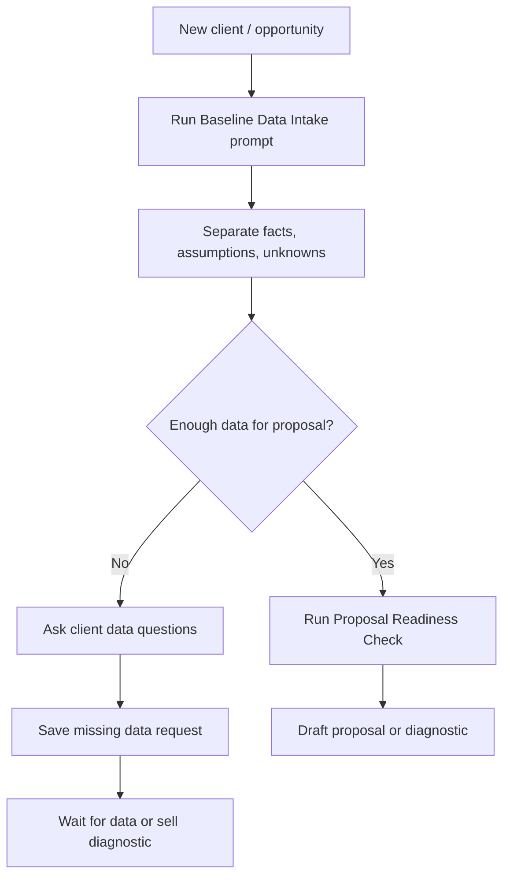
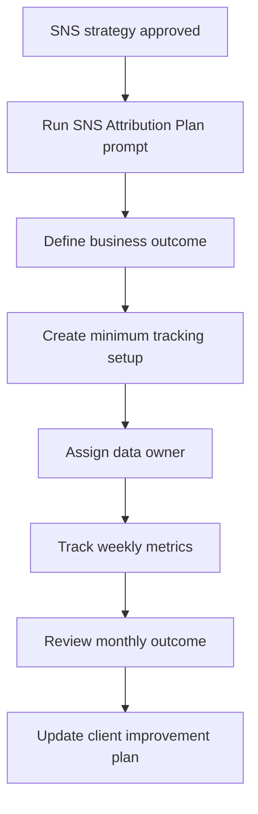
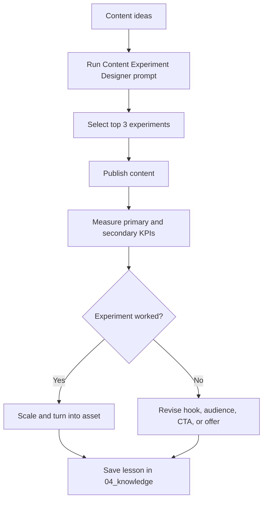
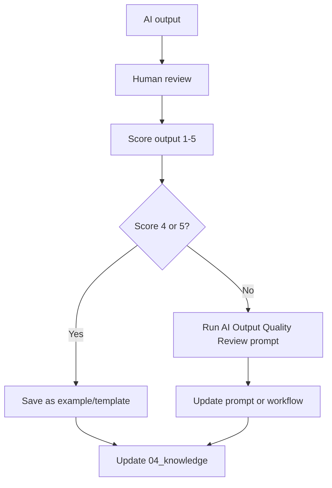

# Workflow Diagrams

## Sales Call to Proposal

## Client Intake to SNS Strategy

## Weekly Content Production

## Monthly Client Improvement

## Objection to Asset Improvement

## Baseline Data Intake

## SNS Attribution Setup

## Content Experiment Loop

## AI Employee Learning Loop

